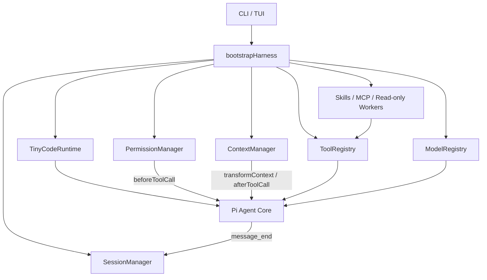

<div align="center">

<pre>
 _____ _             ____          _
|_   _(_)_ __  _   _/ ___|___   __| | ___
  | | | | '_ \| | | | |  / _ \ / _` |/ _ \
  | | | | | | | |_| | |__| (_) | (_| |  __/
  |_| |_|_| |_|\__, |\____\___/ \__,_|\___|
               |___/
</pre>

# TinyCode

**一个基于 Pi Agent Core 构建的轻量级终端 Coding Agent。**

在当前目录启动，用自然语言读取、修改、检索代码并运行命令；同时保留权限闸门、会话恢复、上下文压缩、Skills、MCP 与只读子 Agent。

[](https://github.com/yftx293/tinycode/actions/workflows/ci.yml)
[](https://nodejs.org/)
[](https://www.typescriptlang.org/)
[](./LICENSE)

简体中文 · [English](./README_EN.md)

</div>

> [!IMPORTANT]
> TinyCode 是一个独立的学习型重实现项目，并非原始 TinyCode、Pi、OpenAI Codex 或 Claude Code 的官方发行版。当前版本从源码安装，尚未发布到 npm。

## 为什么是 TinyCode？

很多 Coding Agent 要么只演示模型调用，要么把会话、工具、安全策略和扩展能力揉在一起。TinyCode 选择一个更容易理解和验证的边界：**Pi 负责 Agent Loop，本项目负责 Harness 策略。**

```text
你负责提出目标
TinyCode 负责工作区、工具、权限、会话和扩展
Pi 负责模型流式调用、工具调度、生命周期和中止
```

它适合：

- 学习一个终端 Coding Agent 的完整工程链路。
- 在本地项目中体验可恢复的多轮代码任务。
- 验证权限规则、Context 工程、Skill、MCP 和子 Agent 设计。
- 作为进一步实验的清晰 TypeScript 基线。

## 终端体验

启动后编辑器会立即获得焦点，不需要先经过菜单。欢迎区会展示当前模型、工作目录、权限模式、Session 和当前项目最近的会话。

```text
╭──────────────────────────────────────────────────────────────────────────╮
│ TinyCode v0.1.0  ·  专注、轻量的终端 Coding Agent                       │
├──────────────────────────────────────────────────────────────────────────┤
│ 项目  D:\workspace\my-project                                            │
│ 模型  deepseek/<model-id>   权限  ask   会话  019c1234                   │
├──────────────────────────────────────────────────────────────────────────┤
│ 最近会话                                                                 │
│ 09-09 13:20  修复登录页校验逻辑  · 8 条 · 019c0abc                      │
├──────────────────────────────────────────────────────────────────────────┤
│ Ctrl+R 继续会话   Ctrl+N 新建会话   /help 帮助   /settings 设置          │
╰──────────────────────────────────────────────────────────────────────────╯
```

宽终端显示完整欢迎区，窄终端自动切换为紧凑布局；设置 `NO_COLOR` 或 `TERM=dumb` 后会关闭装饰颜色。发送第一条消息或恢复历史会话后，欢迎区自动折叠并保留终端滚动历史。

## 核心能力

| 能力 | 当前实现 |
| --- | --- |
| Agent Runtime | 基于 `@earendil-works/pi-agent-core`，支持流式消息、工具调用、生命周期事件与中止 |
| 编码工具 | `read`、`write`、`edit`、`bash`、`grep`、`find`、`ls` |
| 工作区边界 | 文件工具执行 lexical + realpath 检查，阻止路径穿越和符号链接逃逸 |
| 权限闸门 | `ALLOW / ASK / DENY`；交互模式支持单次允许、进程内始终允许和拒绝 |
| 会话恢复 | UUIDv7、append-only JSONL、同目录继续、显式 Session 恢复和历史 transcript 加载 |
| Context 管理 | 确定性 Token 估算、临时上下文压缩、超长工具结果截断与 artifact 保留 |
| Skills | 扫描用户级和项目级 `SKILL.md`，元数据先披露，正文通过 `load_skill` 按需加载 |
| MCP | 并行连接本地 stdio Server，将文本工具结果适配进统一工具表；单点失败隔离 |
| 子 Agent | 最多 3 个进程内只读 Worker，独立 transcript，只能使用读取类工具 |
| TUI | 响应式欢迎页、流式 transcript、工具结果、权限弹窗、设置面板、状态栏和会话选择器 |
| 离线验证 | 脚本化 Mock Provider；默认测试不需要网络或 API Key |

## 快速开始

### 1. 获取并构建

要求 Node.js `>=22.19.0` 和 npm。

```bash
git clone https://github.com/yftx293/tinycode.git
cd tinycode
npm ci
npm run build
```

### 2. 注册本地全局命令

```bash
npm link
```

此后可以在任意项目目录运行 `tinycode`，当前目录会成为工作区：

```bash
cd /path/to/your/project
tinycode
```

Windows PowerShell 示例：

```powershell
cd D:\workspace\your-project
tinycode
```

### 3. 第一次启动

首次交互启动会提示选择：

1. `mock/mock`：完全离线，无需 API Key，适合验证安装和界面。
2. 真实模型：输入 Pi 模型目录中的 `provider/model`。

选择结果和非敏感设置会保存在 `~/.tinycode/config.json`，后续启动会自动复用。API Key **不会**写入该文件，必须通过环境变量提供。

```powershell
# PowerShell：仅对当前终端会话生效
$env:DEEPSEEK_API_KEY = "your-api-key"
tinycode
```

```bash
# macOS / Linux：仅对当前 shell 会话生效
export DEEPSEEK_API_KEY="your-api-key"
tinycode
```

在首次配置中选择真实模型，然后输入 `deepseek/<model-id>`。可先查看当前依赖版本实际提供的模型 ID：

```bash
tinycode --list-models
```

常见 Provider 使用的环境变量包括 `DEEPSEEK_API_KEY`、`OPENAI_API_KEY`、`ANTHROPIC_API_KEY` 和 `GEMINI_API_KEY`；模型是否可用取决于当前 Pi 模型目录、账号权限与 Provider 服务。

## 常用命令

### CLI 参数

| 参数 | 作用 |
| --- | --- |
| `-h`, `--help` | 显示帮助 |
| `-v`, `--version` | 显示版本 |
| `--model <model\|provider/model>` | 为本次运行选择模型 |
| `--mock` | 使用离线 Mock 模型 |
| `--list-models` | 列出当前 Pi 目录中的模型 |
| `-p`, `--prompt <text>` | 非交互执行一次请求并输出最终回复 |
| `--continue` | 恢复当前工作目录最近一次 Session |
| `--session <id>` | 恢复指定 Session |
| `--permission-mode <ask\|auto>` | 设置本次运行的权限模式 |

示例：

```bash
# 离线检查安装
tinycode --mock

# 临时指定真实模型
tinycode --model deepseek/<model-id>

# 非交互单次请求
tinycode --model deepseek/<model-id> -p "概括这个项目的结构"

# 继续当前目录最近一次会话
tinycode --continue
```

### TUI 命令

| 命令 | 作用 |
| --- | --- |
| `/help` | 查看全部命令 |
| `/new` | 创建新 Session 并清空 live messages |
| `/clear` | 只清空当前 live context，不创建 Session，也不改写原日志 |
| `/resume <id>` | 恢复指定 Session |
| `/sessions` | 列出当前项目的 Session |
| `/model [provider/model]` | 查看或临时切换当前模型 |
| `/settings` | 打开中文设置面板并保存用户配置 |
| `/skills` | 列出已加载 Skill |
| `/mcp` | 查看 MCP Server 状态 |
| `/agents` | 查看只读 Worker 状态 |
| `/compact` | 手动压缩当前内存 Context |
| `/status` | 查看运行状态 |
| `/exit` | 退出 TinyCode |

### 快捷键

| 快捷键 | 行为 |
| --- | --- |
| `Ctrl+R` | 打开当前项目的最近会话选择器 |
| `Ctrl+N` | 创建新 Session |
| `Ctrl+C` | 忙碌时中止；空闲时两秒内按两次退出 |
| `Ctrl+D` | 退出 |
| `Esc` | 忙碌时中止；在选择浮层中取消 |

会话快捷键在 Agent 忙碌时不会执行，而是显示提示。

## 配置

配置优先级从高到低为：

```text
CLI 参数 > 环境变量 > 项目 .tinycode/config.json > 用户 ~/.tinycode/config.json > 默认值
```

不含密钥的配置示例：

```json
{
  "model": {
    "provider": "deepseek",
    "model": "<model-id>"
  },
  "maxOutputTokens": 4096,
  "permissionMode": "ask",
  "context": {
    "maxTokens": 32000,
    "compactThreshold": 0.8,
    "toolResultMaxChars": 12000
  },
  "mcpServers": {
    "example": {
      "command": "node",
      "args": ["./server.js"],
      "env": {}
    }
  }
}
```

> [!CAUTION]
> 不要把 API Key、Token 或密码放入配置文件、MCP `env`、Session、Issue、日志或 Git 提交。请使用 Provider 对应的环境变量。

| 环境变量 | 默认值 / 作用 |
| --- | --- |
| `TINYCODE_PROVIDER` | 模型 Provider |
| `TINYCODE_MODEL` | 模型 ID；也可设为 `mock` |
| `TINYCODE_PERMISSION_MODE` | `ask` |
| `TINYCODE_MAX_OUTPUT_TOKENS` | `4096` |
| `TINYCODE_CONTEXT_MAX_TOKENS` | `32000` |
| `TINYCODE_CONTEXT_COMPACT_THRESHOLD` | `0.8` |
| `TINYCODE_CONTEXT_TOOL_RESULT_MAX_CHARS` | `12000` |
| `TINYCODE_HOME` | 覆盖默认 Session 目录 `~/.tinycode/sessions` |

这些设置也可以通过 TUI 中的 `/settings` 修改。保存后 TinyCode 会基于当前 Session 重建 Harness，使设置立即生效。

## 权限与安全边界

TinyCode 在每次工具执行前经过统一权限判断：

| 操作 | `ask` 模式 | `auto` 模式 |
| --- | --- | --- |
| 工作区内读取、检索、列目录 | 自动允许 | 自动允许 |
| 写入、编辑、普通风险命令 | 弹窗确认 | 自动允许 |
| 明确识别的破坏性命令 | 强制拒绝 | 强制拒绝 |
| Headless 模式中的 ASK 操作 | 因无审批界面而拒绝 | 自动允许 |

`auto` 不会覆盖硬拒绝规则，但它会自动批准普通写操作和风险命令，请只在可信工作区使用。

> [!WARNING]
> 权限系统是应用层策略，不是操作系统沙箱。`bash` 仍以当前用户身份在宿主机执行，TinyCode 没有容器、虚拟机、网络隔离或系统级资源配额。运行前请使用 Git 保存工作，并审查重要改动。

## 会话、Context 与项目指令

- Session 采用 append-only JSONL，默认保存在 `~/.tinycode/sessions`。
- `--continue` 和最近会话列表只匹配相同工作目录。
- 恢复后会重新加载用户消息、助手消息和工具结果。
- 自动 Context 压缩只改变本次发给模型的临时视图，不删除完整 Session 历史。
- 超长工具结果会在模型上下文中截断，完整文本写入对应 Session artifact。
- 手动 `/compact` 只修改当前内存历史，不回写旧 Session。
- 项目根目录中的 `TINY.md`、`AGENTS.md` 和 `CLAUDE.md` 会作为项目指令加入 System Prompt。

Session 可能包含提示词、源码片段和工具输出。**不要把 `~/.tinycode/sessions` 上传到公开仓库。**

## Skills、MCP 与只读 Worker

### Skills

TinyCode 扫描以下位置：

```text
~/.tinycode/skills/<name>/SKILL.md
<project>/.tinycode/skills/<name>/SKILL.md
```

项目同名 Skill 覆盖用户 Skill。启动时只有 name/description 进入提示词，正文必须由模型调用 `load_skill(name)` 后才进入上下文。

### MCP

当前仅支持本地 stdio MCP Server。多个 Server 并行连接；某个 Server 连接失败不会阻止内置工具和其他健康 Server 启动。第一版 MCP 结果只保留文本块。

### 只读 Worker

主 Agent 可以通过 `spawn_agent`、`list_agents`、`wait_agent` 和 `close_agent` 管理最多 3 个 Worker。每个 Worker 使用独立 Pi Agent 和 transcript，只拥有 `read`、`grep`、`find`、`ls`，不能写文件、执行 Bash 或继续创建 Worker。

## 架构



关键边界：

- Pi Agent Core：模型流式调用、Agent Loop、工具调度、事件与中止。
- TinyCode Harness：模型选择、工具注册、路径边界、权限、Session、Context 和扩展装配。
- `bootstrapHarness()`：唯一依赖装配中心。

更完整的设计与阶段实现约束见 [`Agent.md`](./Agent.md)。

## 开发与验证

```bash
npm ci
npm run typecheck
npm run lint
npm test
npm run build
```

默认测试集完全离线，包含真实 Pi Loop 驱动真实文件工具的修复 E2E，以及交互式伪终端测试。CI 在 Node.js 22.19 和 Node.js 24 上执行全部质量门禁。

## 当前限制

- 尚未发布 npm 包，需要 clone、build 和 `npm link`。
- Bash 不是 OS 沙箱。
- 不支持 MCP HTTP/SSE、OAuth、资源、Prompt 模板和多模态结果。
- 手动压缩没有持久化 compaction record。
- Worker 是进程内、只读的，不支持远程执行、任务 DAG 或自由消息总线。
- 不支持运行中 steer/follow-up 输入队列、Web UI、IDE 插件、遥测和成本看板。
- 真实模型调用依赖第三方 Provider、Pi 模型目录和用户自己的 API Key，默认测试不验证真实模型稳定性。

## 致谢

- [Pi](https://github.com/earendil-works/pi)：提供 Agent Core、模型目录和终端 UI 基础能力。
- [helsome/tinycode](https://github.com/helsome/tinycode)：本项目核心功能复现的参考实现。
- [Model Context Protocol](https://modelcontextprotocol.io/)：本地工具扩展协议。

## 许可证

本项目基于 [MIT License](./LICENSE) 开源。

---

<div align="center">

如果这个项目对你理解 Coding Agent 有帮助，欢迎 Star、提交 Issue 或参与改进。

</div>
