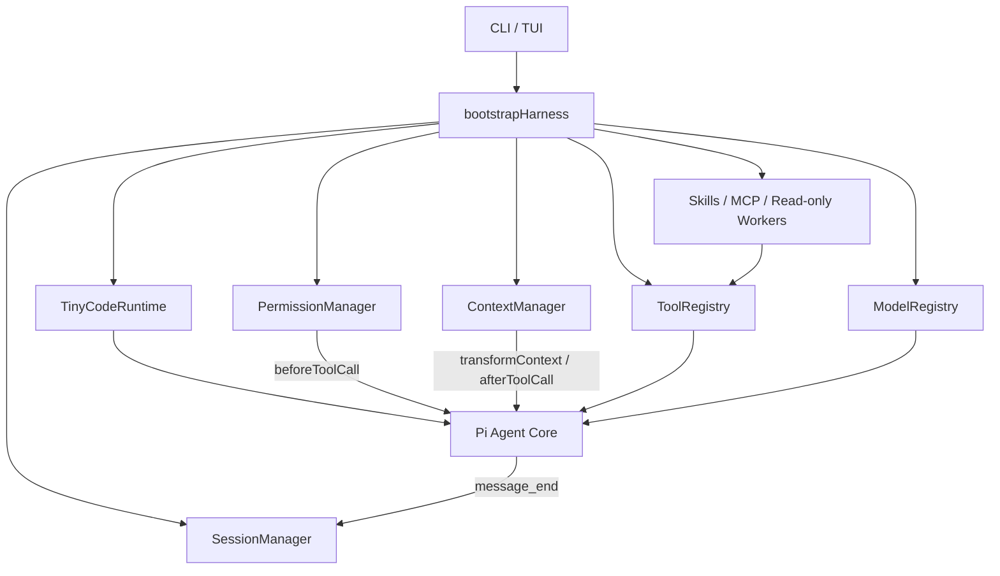

<div align="center">

<pre>
 _____ _             ____          _
|_   _(_)_ __  _   _/ ___|___   __| | ___
  | | | | '_ \| | | | |  / _ \ / _` |/ _ \
  | | | | | | | |_| | |__| (_) | (_| |  __/
  |_| |_|_| |_|\__, |\____\___/ \__,_|\___|
               |___/
</pre>

# TinyCode

**A lightweight terminal coding agent built on Pi Agent Core.**

Launch it in a directory and use natural language to inspect, search, edit, and test a codebase—with permission gates, resumable sessions, context compaction, Skills, MCP, and read-only workers.

[](https://github.com/yftx293/tinycode/actions/workflows/ci.yml)
[](https://nodejs.org/)
[](https://www.typescriptlang.org/)
[](./LICENSE)

[简体中文](./README.md) · English

</div>

> [!IMPORTANT]
> TinyCode is an independent educational reimplementation. It is not an official distribution of the original TinyCode, Pi, OpenAI Codex, or Claude Code. The current version is installed from source and is not published to npm.

## Why TinyCode?

TinyCode keeps one architectural boundary explicit: **Pi owns the Agent Loop; this project owns the Harness policy.**

```text
You provide the goal
TinyCode provides workspace tools, permissions, sessions, context, and extensions
Pi provides model streaming, tool dispatch, lifecycle events, and cancellation
```

It is useful for:

- Studying the complete engineering path of a terminal coding agent.
- Running resumable, multi-turn coding tasks in a local project.
- Experimenting with permission rules, context engineering, Skills, MCP, and workers.
- Starting from a small, testable TypeScript harness.

## Terminal experience

The editor receives focus immediately on startup. The responsive welcome area shows the active model, workspace, permission mode, Session, and recent tasks for the current project.

```text
╭──────────────────────────────────────────────────────────────────────────╮
│ TinyCode v0.1.0  ·  专注、轻量的终端 Coding Agent                       │
├──────────────────────────────────────────────────────────────────────────┤
│ 项目  D:\workspace\my-project                                            │
│ 模型  deepseek/<model-id>   权限  ask   会话  019c1234                   │
├──────────────────────────────────────────────────────────────────────────┤
│ 最近会话                                                                 │
│ 09-09 13:20  Fix login validation  · 8 条 · 019c0abc                    │
├──────────────────────────────────────────────────────────────────────────┤
│ Ctrl+R 继续会话   Ctrl+N 新建会话   /help 帮助   /settings 设置          │
╰──────────────────────────────────────────────────────────────────────────╯
```

Wide terminals get the full welcome view; narrow terminals use a compact layout. `NO_COLOR` and `TERM=dumb` disable decorative colors. The welcome area folds after the first prompt or a successful resume while normal terminal scrollback remains available.

## Features

| Area | Current implementation |
| --- | --- |
| Agent runtime | Built on `@earendil-works/pi-agent-core`, with streaming messages, tool calls, lifecycle events, and cancellation |
| Coding tools | `read`, `write`, `edit`, `bash`, `grep`, `find`, and `ls` |
| Workspace boundary | Lexical and realpath checks for file tools, including traversal and symlink-escape protection |
| Permission gate | `ALLOW / ASK / DENY`, with allow-once, process-local always-allow, and deny choices in the TUI |
| Sessions | UUIDv7 append-only JSONL, cwd-scoped continuation, explicit resume, and transcript restoration |
| Context | Deterministic token estimates, temporary compaction, truncated tool results, and full artifacts |
| Skills | User/project `SKILL.md` discovery with metadata-first, body-on-demand disclosure |
| MCP | Parallel local stdio connections, text tool-result adaptation, and per-server failure isolation |
| Workers | Up to three in-process, read-only workers with independent Pi agents and transcripts |
| TUI | Responsive welcome view, streaming transcript, tool output, permission dialogs, settings, status, and session picker |
| Offline testing | Scripted Mock Provider; the default test suite requires neither network access nor API keys |

## Quick start

### 1. Clone and build

TinyCode requires Node.js `>=22.19.0` and npm.

```bash
git clone https://github.com/yftx293/tinycode.git
cd tinycode
npm ci
npm run build
```

### 2. Register the local global command

```bash
npm link
```

Run `tinycode` from any project directory; that directory becomes the workspace:

```bash
cd /path/to/your/project
tinycode
```

PowerShell:

```powershell
cd D:\workspace\your-project
tinycode
```

### 3. Complete first-run setup

The first interactive launch offers two choices:

1. `mock/mock`: fully offline and suitable for checking the installation and UI.
2. A real `provider/model` from Pi's model catalog.

The selected model and non-secret settings are saved to `~/.tinycode/config.json`. API keys are **not** written to that file; provide them through environment variables.

```powershell
# PowerShell: current terminal session only
$env:DEEPSEEK_API_KEY = "your-api-key"
tinycode
```

```bash
# macOS / Linux: current shell session only
export DEEPSEEK_API_KEY="your-api-key"
tinycode
```

Choose real-model setup and enter `deepseek/<model-id>`. To see model IDs available in the installed Pi catalog:

```bash
tinycode --list-models
```

Common provider variables include `DEEPSEEK_API_KEY`, `OPENAI_API_KEY`, `ANTHROPIC_API_KEY`, and `GEMINI_API_KEY`. Actual model availability depends on the installed Pi catalog, your provider account, and the provider service.

## Commands

### CLI options

| Option | Behavior |
| --- | --- |
| `-h`, `--help` | Show help |
| `-v`, `--version` | Show the installed version |
| `--model <model\|provider/model>` | Select a model for this run |
| `--mock` | Use the offline Mock Provider |
| `--list-models` | List models from the current Pi catalog |
| `-p`, `--prompt <text>` | Run one non-interactive prompt and print the final response |
| `--continue` | Resume the latest Session for the current cwd |
| `--session <id>` | Resume an explicit Session |
| `--permission-mode <ask\|auto>` | Select the permission mode for this run |

```bash
tinycode --mock
tinycode --model deepseek/<model-id>
tinycode --model deepseek/<model-id> -p "Summarize this project"
tinycode --continue
```

### TUI commands

| Command | Behavior |
| --- | --- |
| `/help` | Show all commands |
| `/new` | Create a Session and clear live messages |
| `/clear` | Clear only live context; keep the Session and its persisted log |
| `/resume <id>` | Resume an explicit Session |
| `/sessions` | List Sessions for the current project |
| `/model [provider/model]` | Show or temporarily switch the active model |
| `/settings` | Open the localized settings panel and save user configuration |
| `/skills` | List loaded Skills |
| `/mcp` | Show MCP Server status |
| `/agents` | Show read-only worker status |
| `/compact` | Compact the current in-memory context |
| `/status` | Show runtime status |
| `/exit` | Exit TinyCode |

### Keyboard shortcuts

| Shortcut | Behavior |
| --- | --- |
| `Ctrl+R` | Open the recent-session picker for this project |
| `Ctrl+N` | Create a new Session |
| `Ctrl+C` | Abort when busy; press twice within two seconds to exit when idle |
| `Ctrl+D` | Exit |
| `Esc` | Abort when busy or cancel a selection overlay |

Session shortcuts do not run while the Agent is busy; TinyCode displays a notice instead.

## Configuration

Precedence, from highest to lowest:

```text
CLI > environment > project .tinycode/config.json > user ~/.tinycode/config.json > defaults
```

Secret-free example:

```json
{
  "model": {
    "provider": "deepseek",
    "model": "<model-id>"
  },
  "maxOutputTokens": 4096,
  "permissionMode": "ask",
  "context": {
    "maxTokens": 32000,
    "compactThreshold": 0.8,
    "toolResultMaxChars": 12000
  },
  "mcpServers": {
    "example": {
      "command": "node",
      "args": ["./server.js"],
      "env": {}
    }
  }
}
```

> [!CAUTION]
> Do not place API keys, tokens, or passwords in configuration files, MCP `env`, Sessions, issues, logs, or Git commits. Use provider-specific environment variables.

| Environment variable | Default / purpose |
| --- | --- |
| `TINYCODE_PROVIDER` | Model provider |
| `TINYCODE_MODEL` | Model ID; may also be `mock` |
| `TINYCODE_PERMISSION_MODE` | `ask` |
| `TINYCODE_MAX_OUTPUT_TOKENS` | `4096` |
| `TINYCODE_CONTEXT_MAX_TOKENS` | `32000` |
| `TINYCODE_CONTEXT_COMPACT_THRESHOLD` | `0.8` |
| `TINYCODE_CONTEXT_TOOL_RESULT_MAX_CHARS` | `12000` |
| `TINYCODE_HOME` | Overrides the default Session directory `~/.tinycode/sessions` |

The same non-secret settings are available through `/settings`. TinyCode rebuilds the Harness against the current Session after saving so the changes apply immediately.

## Permissions and security boundary

Every tool call passes through the permission policy before execution:

| Operation | `ask` mode | `auto` mode |
| --- | --- | --- |
| Workspace reads, searches, and directory listings | Allowed | Allowed |
| Writes, edits, and ordinary risky commands | TUI approval | Allowed automatically |
| Recognized destructive commands | Hard denied | Hard denied |
| ASK operations in headless mode | Denied because no prompt exists | Allowed automatically |

`auto` never overrides hard-deny rules, but it does approve ordinary writes and risky commands. Use it only in a trusted workspace.

> [!WARNING]
> The permission system is application policy, not an operating-system sandbox. `bash` runs on the host as the current user. TinyCode does not provide a container, VM, network isolation, or system-level resource quotas. Keep your project under version control and review important changes.

## Sessions, context, and project instructions

- Sessions are append-only JSONL files under `~/.tinycode/sessions` by default.
- `--continue` and the recent-session picker only match the same working directory.
- Resume restores user, assistant, and tool-result transcript entries.
- Automatic compaction changes only the temporary model view and retains full Session history.
- Oversized tool results are truncated in model context while full text is stored as a Session artifact.
- Manual `/compact` changes only live memory and does not rewrite old Session records.
- `TINY.md`, `AGENTS.md`, and `CLAUDE.md` in the project root are appended to the System Prompt.

Sessions can contain prompts, source snippets, and tool output. **Do not publish `~/.tinycode/sessions`.**

## Skills, MCP, and read-only workers

### Skills

TinyCode scans:

```text
~/.tinycode/skills/<name>/SKILL.md
<project>/.tinycode/skills/<name>/SKILL.md
```

A project Skill overrides a user Skill with the same name. Only name and description enter the startup prompt; the body is disclosed after the model calls `load_skill(name)`.

### MCP

The current implementation supports local stdio MCP Servers only. Servers connect in parallel, and one failed Server does not prevent built-in tools or healthy Servers from loading. The first implementation retains text result blocks only.

### Read-only workers

The main Agent can use `spawn_agent`, `list_agents`, `wait_agent`, and `close_agent` to manage up to three workers. Each worker has an independent Pi Agent and transcript and receives only `read`, `grep`, `find`, and `ls`—never write, edit, Bash, Skill loading, or worker-spawning tools.

## Architecture



The boundaries are intentional:

- Pi Agent Core owns model streaming, the Agent Loop, tool dispatch, events, and cancellation.
- TinyCode owns model selection, tool registration, path guards, permissions, Sessions, Context, and extension assembly.
- `bootstrapHarness()` is the single composition root.

See [`Agent.md`](./Agent.md) for the complete architecture and staged implementation contract.

## Development

```bash
npm ci
npm run typecheck
npm run lint
npm test
npm run build
```

The default suite is fully offline. It includes an end-to-end repair driven through the real Pi loop and real file tools, plus interactive pseudo-terminal coverage. CI runs all gates on Node.js 22.19 and Node.js 24.

## Current limitations

- TinyCode is not published to npm; clone, build, and use `npm link`.
- Bash is not an OS sandbox.
- MCP HTTP/SSE, OAuth, resources, prompt templates, and multimodal results are not implemented.
- Manual compaction has no persisted compaction record.
- Workers are in-process and read-only; there is no remote execution, task DAG, or free-form worker bus.
- There is no running-input steer/follow-up queue, Web UI, IDE extension, telemetry, or cost dashboard.
- Real-model use depends on third-party providers, the Pi model catalog, and user-supplied API keys; the default suite does not benchmark real-provider reliability.

## Acknowledgements

- [Pi](https://github.com/earendil-works/pi) for Agent Core, the model catalog, and terminal UI foundations.
- [helsome/tinycode](https://github.com/helsome/tinycode) as the reference implementation for this reimplementation project.
- [Model Context Protocol](https://modelcontextprotocol.io/) for the local tool-extension protocol.

## License

TinyCode is open source under the [MIT License](./LICENSE).

---

<div align="center">

If TinyCode helps you understand coding-agent architecture, consider starring the repository, opening an issue, or contributing an improvement.

</div>
